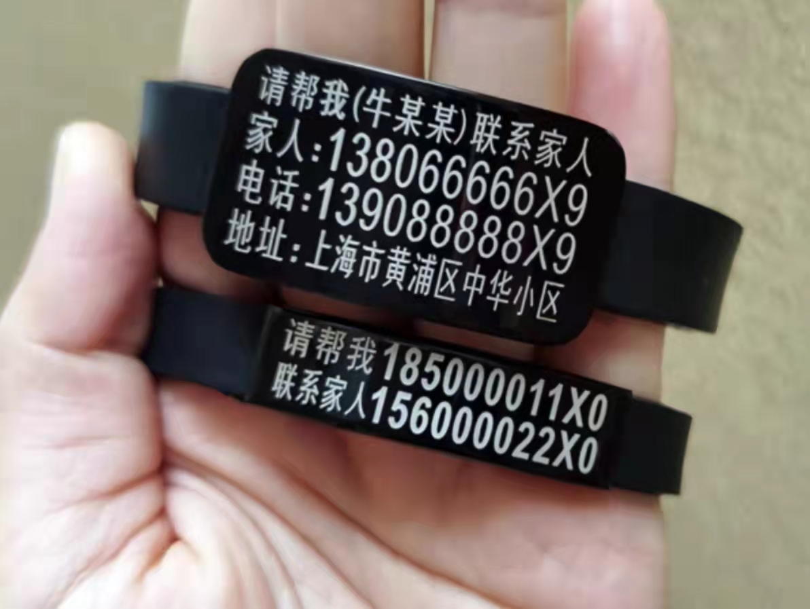
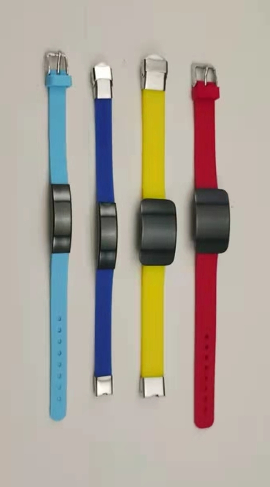
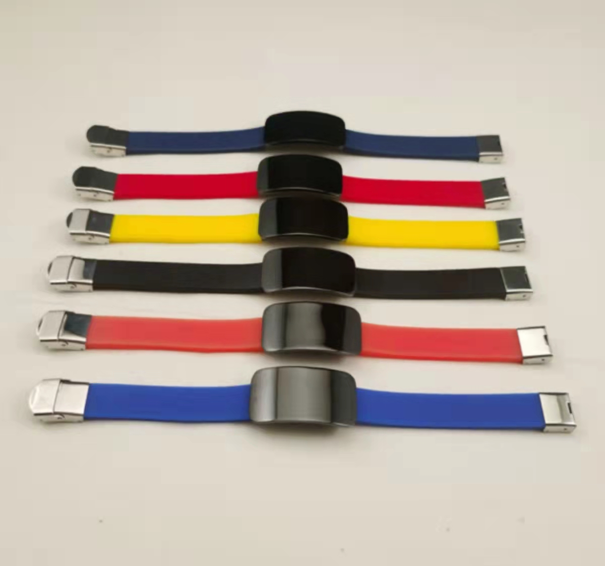
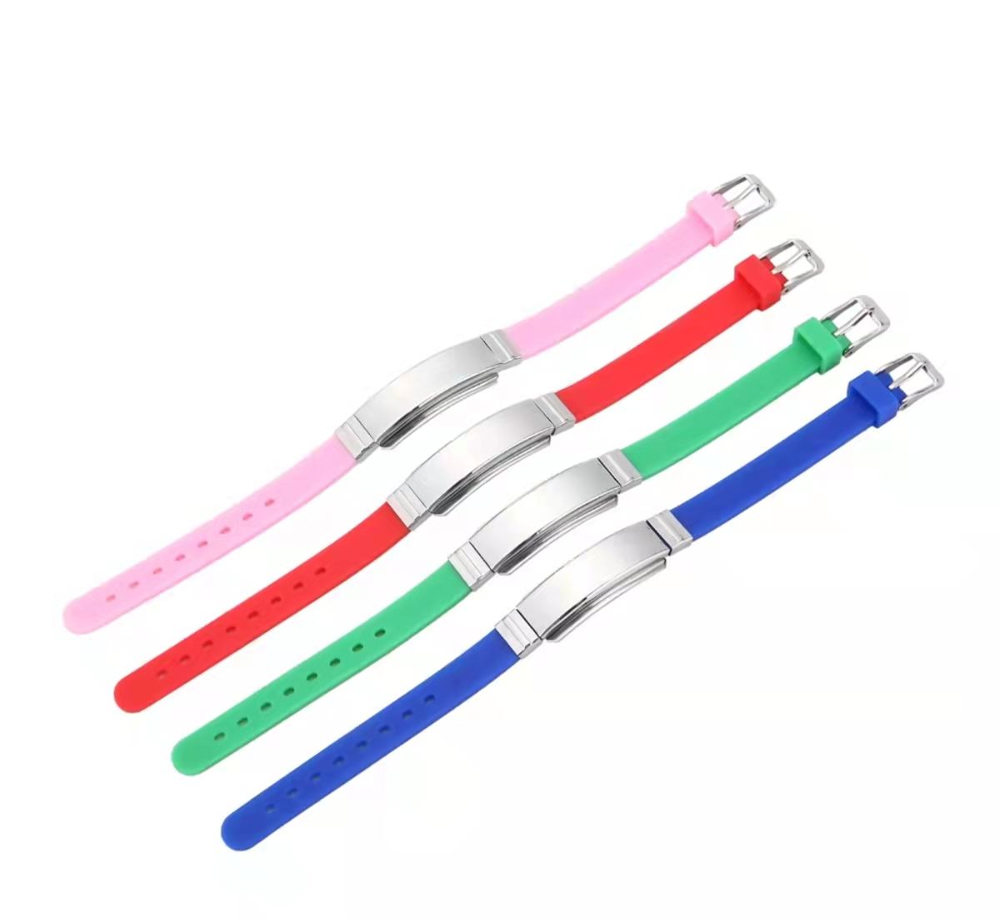
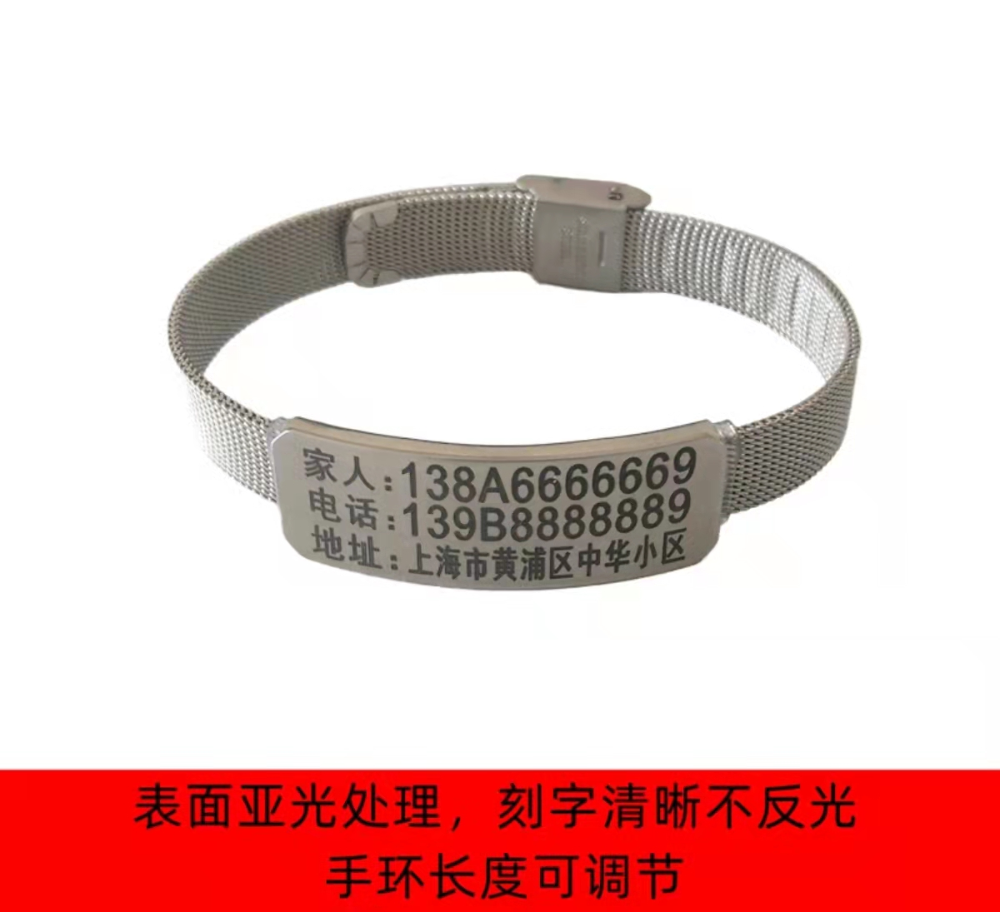
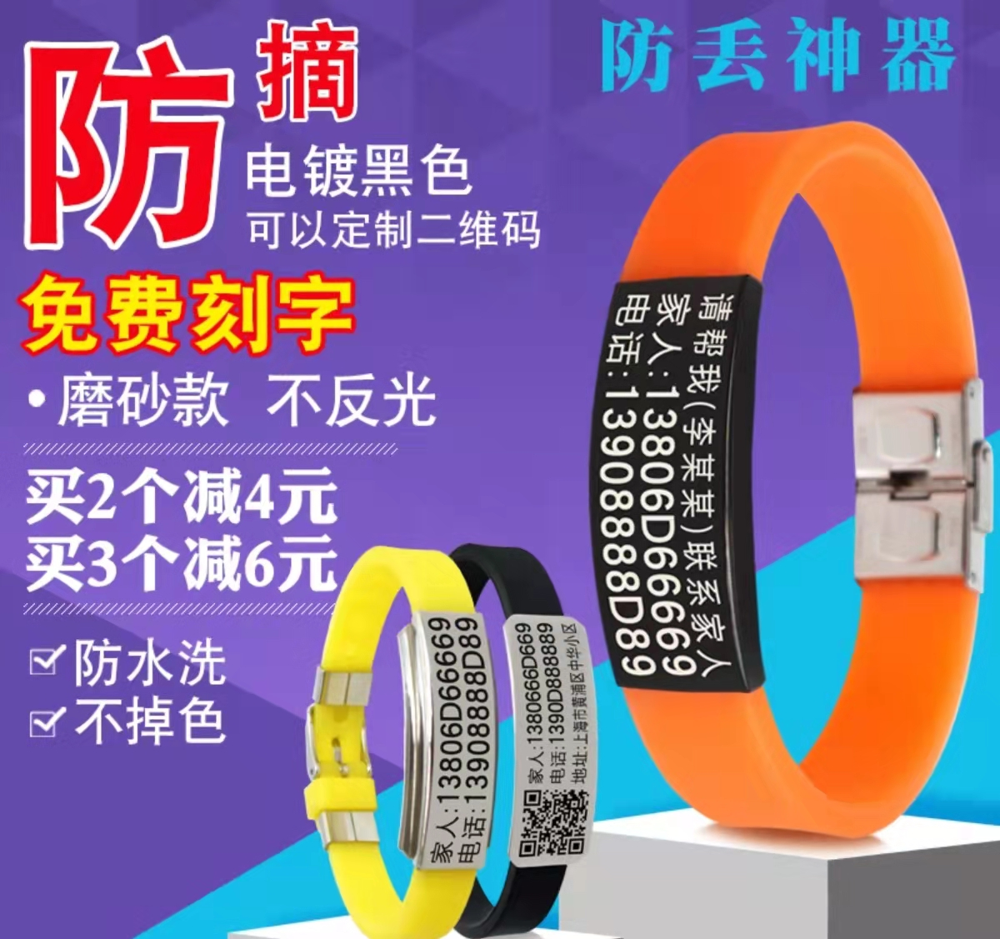
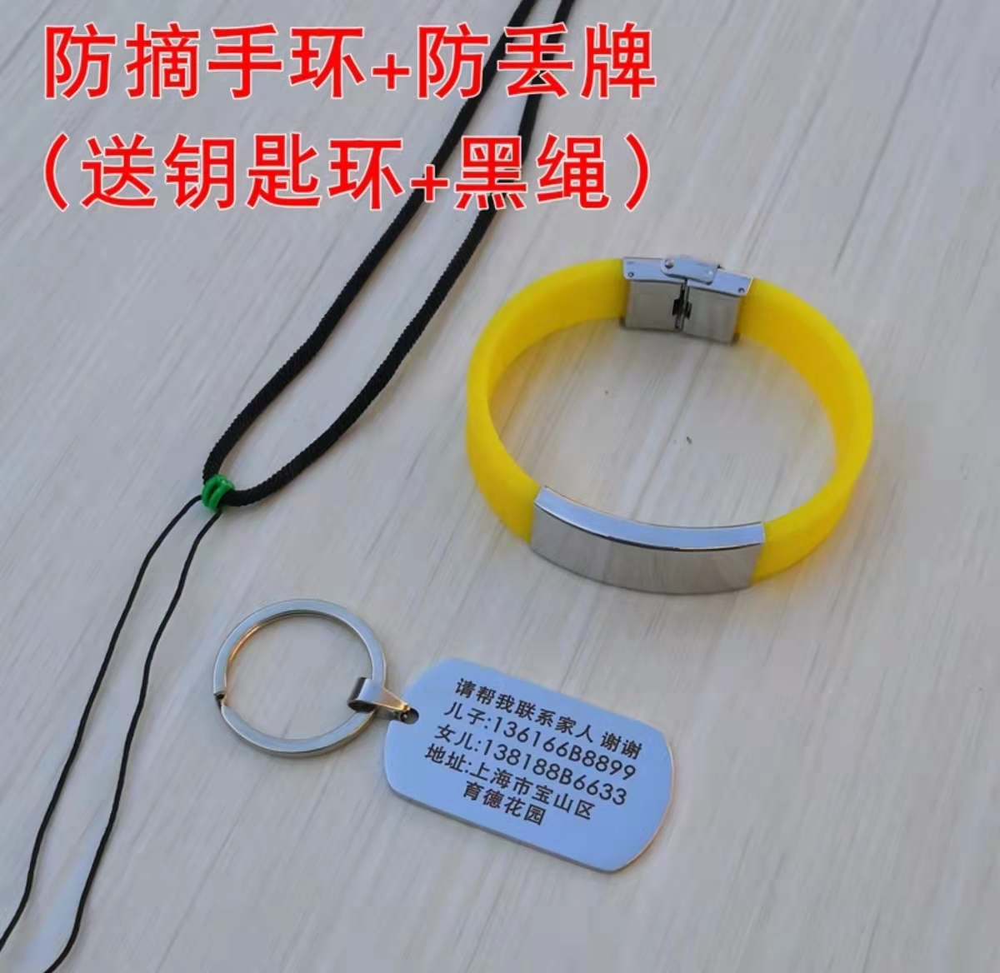

# 老人防丢手环 个性化选项

每一项都可以自由搭配
| 表牌宽度         | 锁扣种类      | 颜色 |材料| 刻字方式|附加  |
|:------------|:-------|:-----|:------|:--|:-----|
| 和表带一样宽 | 手表型    | 纯色 | 硅胶 + 不锈钢|电镀（黑底白字）|配钥匙牌 |
| 加宽         | 很难脱的    | 彩色| 全钛钢   |刻字（白底黑字）  |    |
|||||||

|表牌宽度|锁扣种类|刻字方式|
|---|---|---|
||||

